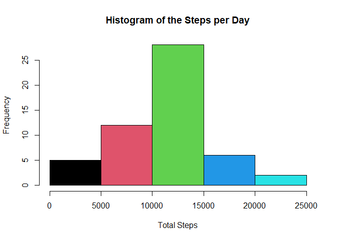
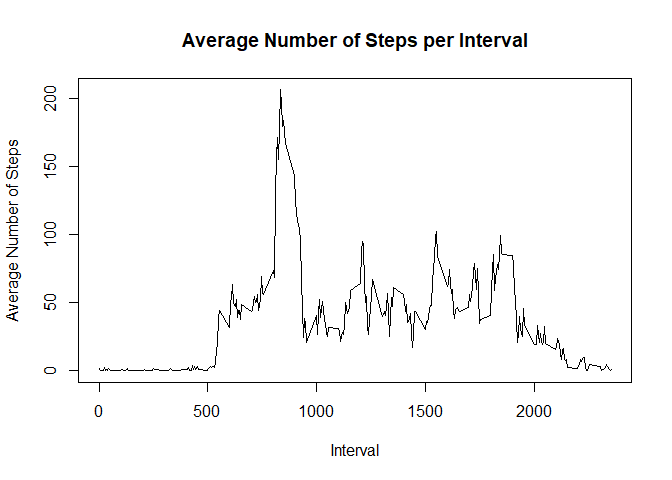
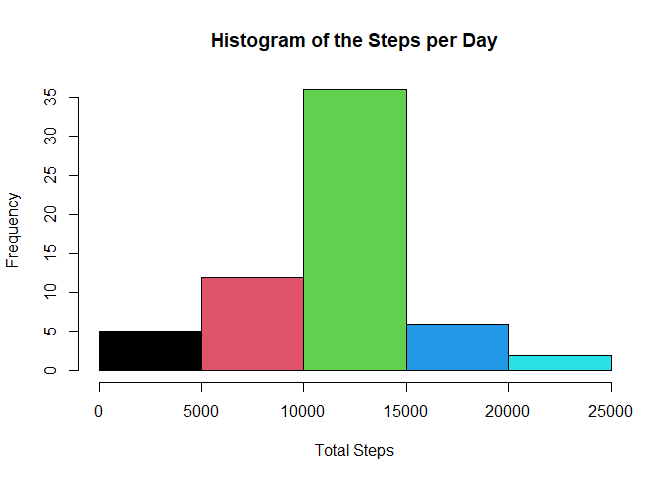
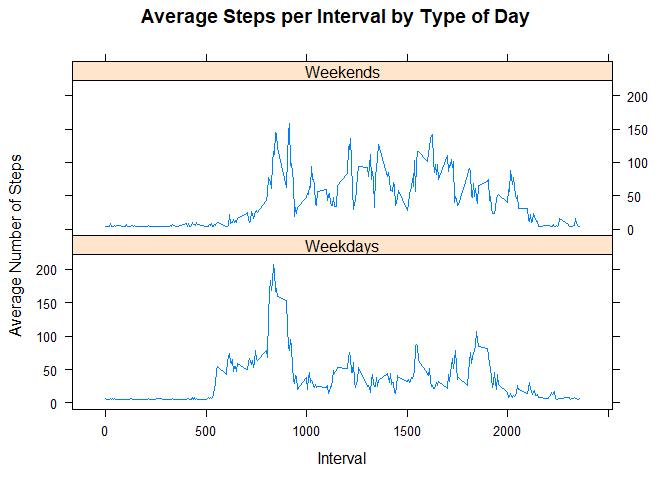

- This assignment is submitted by dwinur10

## Loading and preprocessing the data


```r
# unziping the data set
unzip('activity.zip', exdir = '.')

# loading the data set
rw.dat <- read.csv('activity.csv', header = T)

# showing head and tail of the raw data set
head(rw.dat)
```

```
##   steps       date interval
## 1    NA 2012-10-01        0
## 2    NA 2012-10-01        5
## 3    NA 2012-10-01       10
## 4    NA 2012-10-01       15
## 5    NA 2012-10-01       20
## 6    NA 2012-10-01       25
```

```r
tail(rw.dat)
```

```
##       steps       date interval
## 17563    NA 2012-11-30     2330
## 17564    NA 2012-11-30     2335
## 17565    NA 2012-11-30     2340
## 17566    NA 2012-11-30     2345
## 17567    NA 2012-11-30     2350
## 17568    NA 2012-11-30     2355
```

## What is mean total number of steps taken per day?


```r
# subsetting the total number of steps taken per day
aggr <- aggregate(steps ~ date, data = rw.dat, sum)
```

**Making a histogram of the total number of the total steps:**


```r
hist(aggr$steps, xlab = 'Total Steps', main = 'Histogram of the Steps per Day', col = c(1,2,3,4,5))
```

<!-- -->

**Calculating  the mean and median of the total number of steps taken per day**

```r
# calculate mean
mean(aggr$steps, na.rm = T)
```

```
## [1] 10766.19
```

```r
# calculate median
median(aggr$steps, na.rm = T)
```

```
## [1] 10765
```
## What is the average daily activity pattern?

**Make a time series plot of the 5-minute interval (x-axis) and the average number of steps taken, averaged across all days (y-axis)**

```r
# subsetting the data set
sub.itv <- aggregate(steps ~ interval, data = rw.dat, mean, na.rm = T)

# make time series plot
plot(sub.itv$interval, sub.itv$steps, type = 'l', main = 'Average Number of Steps per Interval', xlab = 'Interval', ylab = 'Average Number of Steps')
```

<!-- -->

**5-minute interval contains the maximum number of steps on average across all the days in the data set**


```r
avg.max <- max(sub.itv$steps)

sub.itv[sub.itv$steps==avg.max, 1]
```

```
## [1] 835
```

## Imputing missing values

**Calculate and report the total number of missing values in the dat aset (i.e. the total number of rows with (NAs)**

```r
na.dat <- sum(is.na(rw.dat$steps))
```

**Devise a strategy for filling in all of the missing values in the dataset. The strategy does not need to be sophisticated. For example, you could use the mean/median for that day, or the mean for that 5-minute interval, etc.**
**Create a new dataset that is equal to the original dataset but with the missing data filled in.**
**I'm choosing to use mean of the Total Number Steps to replace NA Value**


```r
new.dat <- rw.dat
new.dat$steps[is.na(new.dat$steps)] <- mean(rw.dat$steps, na.rm = T)
```

**Make a histogram of the total number of steps taken each day and Calculate and report the mean and median total number of steps taken per day.**


```r
new.aggr <- aggregate(steps ~ date, data = new.dat, sum)

hist(new.aggr$steps, xlab = 'Total Steps', main = 'Histogram of the Steps per Day', col = c(1,2,3,4,5))
```

<!-- -->

```r
# calculate mean
mean(new.aggr$steps)
```

```
## [1] 10766.19
```

```r
# calculate median
median(new.aggr$steps)
```

```
## [1] 10766.19
```

## Are there differences in activity patterns between weekdays and weekends?


**Create a new factor variable in the dataset with two levels – “weekday” and “weekend” indicating whether a given date is a weekday or weekend day**


```r
new.dat$DayType <- weekdays(as.Date(new.dat$date))

new.dat$DayType <- ifelse(new.dat$DayType %in% c('Saturday','Sunday'),'Weekends','Weekdays')
```

**Make a panel plot containing a time series plot of the 5-minute interval (x-axis) and the average number of steps taken, averaged across all weekday days or weekend days (y-axis)**


```r
library(lattice)

new.dat2 <- aggregate(new.dat['steps'], new.dat[c('interval','DayType')], mean)
xyplot(steps ~ interval | DayType, data = new.dat2, type = 'l', layout = c(1,2), 
       main="Average Steps per Interval by Type of Day", 
       ylab="Average Number of Steps", 
       xlab="Interval")
```

<!-- -->
